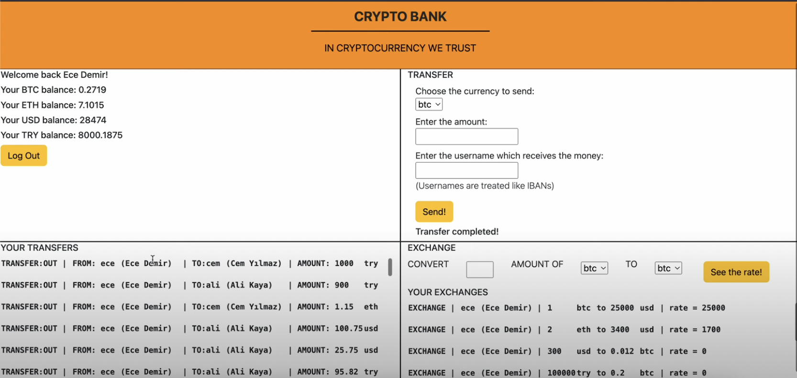

# banking
* Ahmet Ezdesir - Online Banking application that focuses on cryptocurrencies for the database systems course.
* This project has several functionalities and it focuses on the main financial tasks.
* New customers can create an account and existing customers can log in to their account.
* Current balances are shown on the main page.
* Customers can make transfers in four different currencies that our bank offers an account for.
* Customers can exchange their money from one currency into another given the current exchange rates of our bank.
* Customers can see their latest operations such as the latest transfers and exchanges.

* Sample image from the user interface of the online banking application:
* 

* The presentation video link that explains the project is provided below.
* Link: https://www.youtube.com/watch?v=Xt2w04weflA
